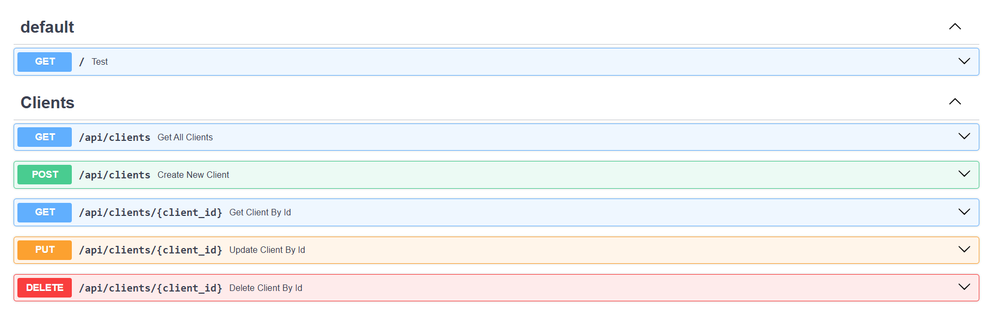
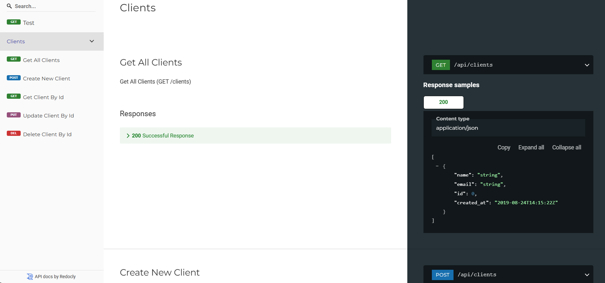

# FastAPI Snowflake REST API

A RESTful API built with FastAPI that connects to Snowflake database for client data management.

## Project Structure
```
FastAPI_Snowflake_RestfulAPI/
|──app
|   |   __init__.py
|   |
|   |──.snowflake
|   |       connections.toml    # Snowflake connection configuration
|   |
|   |──api
|   |   |   routes.py
|   |   |   __init__.py
|   |   |
|   |   |──endpoints
|   |   |   client.py           # Client-related endpoints
|   |   |   __init__.py
|   |
|   |──core
|   |   |   config.py
|   |   |   database.py
|   |   |   __init__.py
|   |
|   |──model
|   |   |   models.py
|   |
|   |──utils
|   |   |   db_helper.py
|   |   |   design_patterns.py
|
|──main.py                     # Application entry point
|──README.md                   # Documentation
└──requirements.txt            # Application dependencies
```

## Prerequisites

- Python 3.9+
- Snowflake account and credentials
- Virtual environment (recommended)

## Installation

1. Clone the repository:
```bash
git clone <repository-url>
cd FastAPI_Snowflake_RestfulAPI
```

2. Create and activate virtual environment:
```bash
python -m venv venv
source venv/bin/activate  # On Windows: venv\Scripts\activate
```

3. Install dependencies:
```bash
pip install -r requirements.txt
```

4. Fill `connections.toml` file in the `app\.snowflake` directory:
```env
user = <snowflake username>
account = <snowflake account alias>
password = <snowflake password>
role = <snowflake account role>
warehouse = <snowflake warehouse name>
database = <snowflake database name>
schema = <snowflake schema name>
```

## Running the Application

1. Start the server:
```bash
python main.py
```
Or using uvicorn directly:
```bash
uvicorn main:app --reload
```

2. The API will be available at:
- API Documentation (Swagger UI): http://localhost:8000/docs
- Alternative Documentation: http://localhost:8000/redoc
- Base URL: http://localhost:8000/api

## API Endpoints

### Clients
- `GET /api/clients` - Retrieve all clients
- Additional endpoints to be added...





## Development

### Database Schema

The application uses the following Snowflake table schema:

```sql
-- Note: UNIQUE constraint was handled from app side
-- as constraints are not enforced in standard tables
-- which are only available for free account
CREATE TABLE CLIENTS (
    ID INTEGER IDENTITY START 1 INCREMENT 1 ORDER PRIMARY KEY NOT NULL,
    NAME VARCHAR(255) NOT NULL,
    EMAIL VARCHAR(255) NOT NULL UNIQUE,
    CREATED_AT TIMESTAMP DEFAULT CURRENT_TIMESTAMP()
);
```

### Adding New Endpoints

1. Create new endpoint file in `app/api/endpoints/`
2. Define routes using FastAPI Router
3. Include router in `app/api/routes.py`

Example:
```python
# app/api/endpoints/new_endpoint.py
from fastapi import APIRouter

router = APIRouter()

@router.get("/path")
async def handler():
    return {"message": "New endpoint"}
```

## Error Handling

The API implements standard HTTP status codes:
- 200: Successful operation
- 400: Bad request
- 404: Resource not found
- 500: Internal server error

## Security

- Toml file for config data
- Snowflake connection best practices
- More security features to be added...
